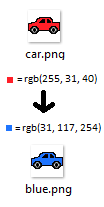
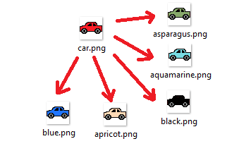

[](https://travis-ci.org/gabrieldarezzo/colorizzar/)
[](https://packagist.org/packages/gabrieldarezzo/colorizzar)
[](https://packagist.org/packages/gabrieldarezzo/colorizzar)  

# Colorizzar 


Change color of an image without lose alpha channel (alpha layer)  
Altere a cor da sua imagem sem perder a camada alpha (camada de transparência)


You can change the color of this [car](https://github.com/gabrieldarezzo/colorizzar/blob/master/car.png?raw=true) (Or any imagem you want), example:


Change color from [red](https://www.webpagefx.com/web-design/random-color-picker/#FF1F28) color pick by Hexadecimal to [blue](https://www.webpagefx.com/web-design/random-color-picker/#1F75FE):  


```php
<?php
require_once 'vendor/autoload.php';

use Colorizzar\ChangeColor;

$changeColor = new ChangeColor('red_car.png');

//From Red Hexadecimal
$changeColor->setFromHex('#FF1F28');

// Will create 'blue.png' in new_cars/ folder
$changeColor->colorizeByNameColor('Blue', 'new_cars/');

```

Or create by specific color name, example from red to blue:  

```php
<?php

require_once 'vendor/autoload.php';

use Colorizzar\ChangeColor;

$changeColor = new ChangeColor('red_car.png');

//From Red Hexadecimal
$changeColor->setFromHex('#FF1F28');
$changeColor->setToHex('#1F75FE');

// Will create 'blue.png' in new_cars/ folder
$changeColor->colorizeKeepAplhaChannnel('new_cars/blue.png');

```   
 
 
Result of   `colorizeKeepAplhaChannnel()`/`colorizeByNameColor()` :

  

-----------


Create all `135` COLORS with `colorizeToAllColors()` !

Example of code:
```php
<?php
....

$changeColor = new ChangeColor('red_car.png');
$changeColor->setFromHex('#FF1F28');
$changeColor->colorizeToAllColors('cars/');
```  

  


### TODO-LIST:
  - FIX (ChangeColorTests.php:testColorizeLoopColors())  
  - FIX require_once() on tests, (Maybe a custom vendor.php for tests)    
  - Create a plugin in JS consume colorizzar and show in realtime result    
  - Improve tests (check in image created has new rgb expected)  
  - (almost done -> `ColorizzarWebService.php`) Create a WebService recive a file and manipulate methods to create dynamic  
  - (done) IMPROVE TODOLIST and update readme with new methods (hexadecimal)  
  - (done) Add DockBlock in all methods  
  - (done) Improve ChangeColor.php SOLID  
  - testExtensionIsFilePng()


#### ColorizzarWebService.php will be:   
  - Hash create by upload image  
  - create a folder with same name of hash  
  - result a JSON with all urls created    


JS-Plugin will consume ColorizzarWebService.php and show final result to user like a magic!   


### Helpfull links
  - Don't know RGB color of your HEX?!  -> https://www.webpagefx.com/web-design/hex-to-rgb/


## How Contribute  
Read:  
https://github.com/gabrieldarezzo/colorizzar/blob/master/CONTRIBUTING.md  


### Thanks to:

 * [@augustohp](https://github.com/augustohp) for code-review and 'JSON to Class' script on commit [@236b6f3734981d9e7f3758b5b5d8e709687675c3](https://github.com/gabrieldarezzo/colorizzar/pull/1/commits/236b6f3734981d9e7f3758b5b5d8e709687675c3)
 * https://stackoverflow.com/users/433392/steap
